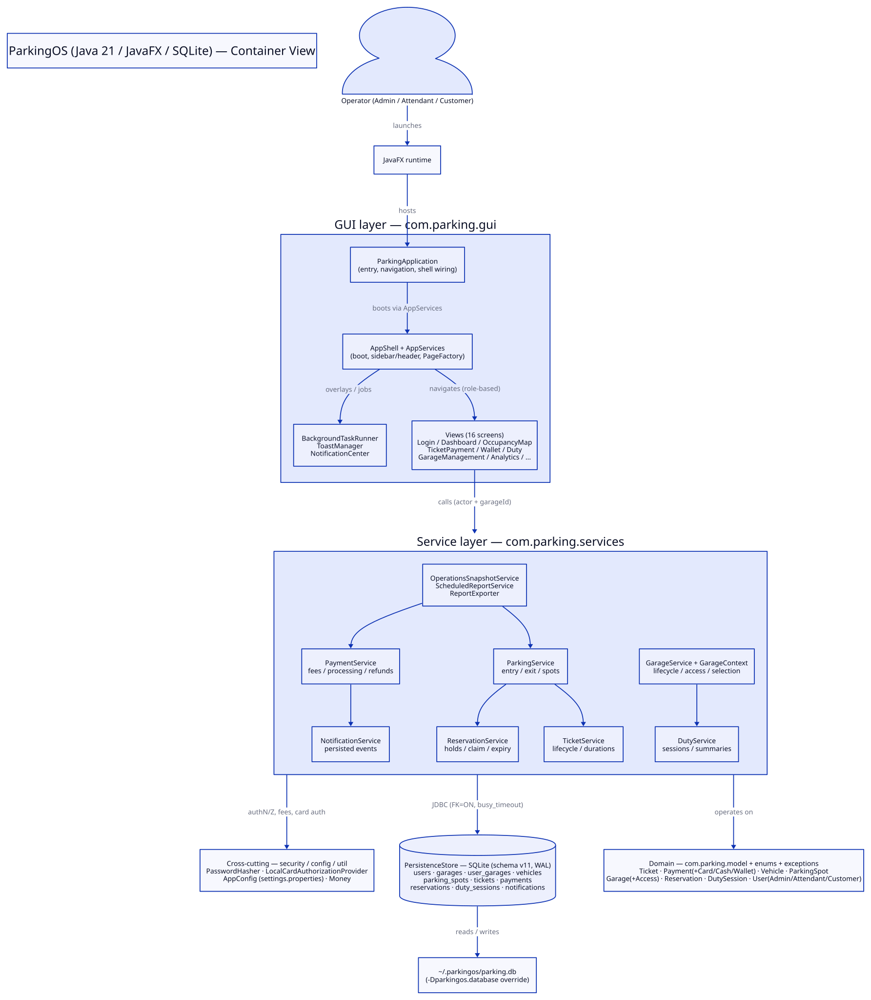

# ParkingOS

[](https://github.com/alaa157/parking-management-system-javafx/actions/workflows/ci.yml)


ParkingOS runs multi-garage parking from one desktop app. You manage garages, park vehicles, collect cash, card, and wallet payments, hold spots with reservations, and report on revenue. Java 21 and JavaFX drive the interface; an embedded SQLite database with versioned migrations stores everything.



## What each role gets

| Capability | Customer | Attendant | Admin |
|---|---|---|---|
| Register and manage vehicles | Yes | No | No |
| Park and reserve spots | Own vehicles | Any vehicle in scope | Any vehicle in scope |
| Pay and exit | Own tickets | Yes | Yes |
| Wallet top-up | Yes | No | No |
| Duty sessions and shift handoff | No | Yes | View |
| User management | No | No | Yes |
| Garage lifecycle and access grants | No | No | Yes |
| Revenue analytics and scheduled reports | No | No | Yes |
| Refunds (full amount, within 14 days) | No | No | Yes |
| Maintenance and parking configuration | No | Spots only | Yes |

You pick your active garage in the header. Admins also get an **All garages** scope. The full access rules live in `docs/AUTHORIZATION.md`.

## Run it in 5 minutes

You need JDK 21 or newer and Maven 3.9 or newer.

```bash
git clone git@github.com:alaa157/parking-management-system-javafx.git
cd parking-management-system-javafx
mvn javafx:run
```

The first launch opens the administrator setup screen because the database holds no users. Create the admin account, then sign in.

For local development with demo fixtures, run this instead:

```bash
mvn -Dparkingos.demo=true javafx:run
```

## Park and charge a vehicle

This run-through shows the core loop. Each step names the screen from the sidebar.

1. Add a vehicle under **My Vehicles** and save it.
2. Open **Active Parking**, pick a level tab, and select an available tile.
3. Choose **Park Here**, pick the vehicle, and confirm **Park Vehicle**. The app creates an `ACTIVE` ticket.
4. Open **Tickets**, select the ticket, and choose **Exit**. The ticket moves to `AWAITING_PAYMENT` with the fee calculated.
5. Pick the **CARD**, **CASH**, or **WALLET** tab and choose **Pay**. The ticket closes, the spot frees, and the customer keeps a receipt.

Reservations follow the same shape: hold a spot, claim it at entry, and the ticket starts automatically. Expiry sweeps run on every spot search, so no timer process is required. `docs/LIFECYCLE.md` maps the state machines behind these flows.

## Configure it

| Property | Default | Purpose |
|---|---|---|
| `parkingos.database` | `~/.parkingos/parking.db` | SQLite database path |
| `parkingos.settings.file` | `~/.parkingos/settings.properties` | Rates, tax, holds, currency |
| `parkingos.reports.directory` | App default | Report export directory |
| `parkingos.demo` | `false` | Seed demo users and fixtures |
| `parkingos.reduceMotion` | `false` | Turn off UI animations |

Default pricing: 10% tax, 5.0 base hourly rate, 5 minute reservation holds, 48 hour maximum stay, USD. Change these under **Settings** and **Parking Config** as an admin.

## Learn the system

| Doc | Contents |
|---|---|
| `docs/ARCHITECTURE.md` | Container view, startup sequence, service catalog, persistence |
| `docs/DATA_MODEL.md` | Entity-relationship diagram, ownership rules, schema tables |
| `docs/LIFECYCLE.md` | Ticket, reservation, spot, and payment state machines |
| `docs/FLOWS.md` | Entry, payment-to-exit, reservation, and duty sequences |
| `docs/AUTHORIZATION.md` | Operational-access decision and per-service enforcement |
| `docs/OPERATIONS.md` | Deploy, backup and restore, migrations, troubleshooting |
| `docs/USER_GUIDES.md` | Customer, attendant, and administrator click-paths |
| `docs/TESTING.md` | Test tiers, commands, and conventions |
| `docs/CONTRIBUTING.md` | Boundaries, theming contract, and workflow |
| `docs/ADRs.md` | Architecture decision records |
| `CONTEXT.md` | Ubiquitous language for garages, access, and tickets |

Diagrams are D2 sources in `docs/diagrams/` with rendered SVGs. Regenerate them with `scripts/render_diagrams.sh` after editing a `.d2` file. Shared agent skills live in `.agents/skills/`.

## Project layout

```text
src/main/java/com/parking/
├── config/       Settings file and startup wiring
├── gui/          Views, shell, theming, and navigation
├── model/        Domain entities and payment types
├── enums/        Ticket, payment, spot, and reservation states
├── exceptions/   Domain and authorization failures
├── security/     Password hashing and card authorization
├── services/     Transactions, access checks, and use cases
├── persistence/  SQLite store and schema migrations
└── util/         Money and formatting helpers
```

Tests mirror these packages under `src/test/java`. Themed CSS is generated from Java tokens; edit the tokens and run `mvn generate-resources`.

## Back up and restore

Copy the database with its `-wal` and `-shm` companions after closing the app. For a backup while the app runs, use the SQLite backup command:

```bash
sqlite3 "$HOME/.parkingos/parking.db" ".backup '$HOME/.parkingos/parking.db.backup'"
```

Migrations are versioned and validated. A failed migration stops startup instead of deleting data, so restore the backup and investigate. Procedures and failure handling live in `docs/OPERATIONS.md`.

## Test it

```bash
mvn test
mvn -Dtest=TicketServiceTest test
```

The suite runs headless with plain JUnit and in-memory SQLite. Only `javafx:run` needs a display. Conventions for new tests live in `docs/TESTING.md`.

## Security model

- No default accounts ship with the app. You create the first admin at setup, customers self-register, and admins provision the rest. Demo fixtures stay behind an explicit flag.
- Passwords are stored as hashes. Card numbers and CVV values never reach the database.
- Garage access is deny by default. Admins hold global scope; everyone else needs an active grant per garage, and archived garages reject all new work.
- Keep database and backup files private.

## Contribute

Read `docs/CONTRIBUTING.md` for the ubiquitous language, module boundaries, and commit conventions. Branch from `main`, keep each pull request to one concern, run `mvn test`, and use conventional commits (`feat:`, `fix:`, `docs:`, `test:`, `chore:`).
