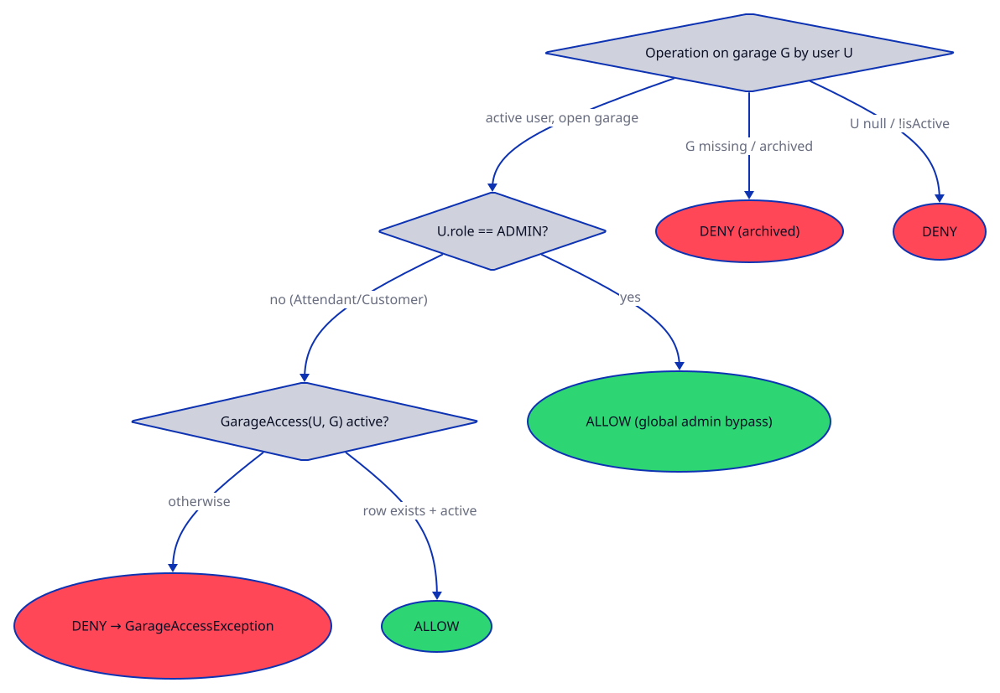

# ParkingOS Authorization

Who may perform parking operations, and where the checks live.
Diagram source: `diagrams/authz.d2` — re-render with
`scripts/render_diagrams.sh` after any change.

Core gate: `GarageService.canAccess` / `requireAccess`
(`services/GarageService.java:68-81`).

## Decision procedure

1. `user == null` or `!user.isActive()` → deny.
2. Garage missing or `archived` → deny.
3. `user.role == ADMIN` → **allow** (global bypass, no `GarageAccess` row needed).
4. Otherwise (`ATTENDANT`, `CUSTOMER`) → allow only if a `GarageAccess`
   (`model/GarageAccess.java:8-13`) row `(userId, garageId)` exists **and is
   active**. `grantAccess` creates `active=true` (`GarageService.java:52-59`);
   `revokeAccess` sets `active=false` (`:61-66`).

## Active garage is UI context, not authorization

`GarageContext` (`services/GarageContext.java:13`) owns the shell's selected
garage. Selection itself is authorized — `select()` delegates to
`requireAccess` (`:37-42`), `selectAll()` is admin-only (`:44-51`) — and services
re-check on every call (`GarageUiScope.java:18-28` passes the selection as a
query hint; `findTickets`/`findPayments` re-verify `ADMIN`/archived/access).
Stale selections (revoked access, archived garage) are cleared by `refresh()`
(`:53-65`), never trusted.

## Per-service enforcement

| Service | Enforcement |
|---|---|
| `GarageService` | Defines `canAccess`/`requireAccess`/`listAccessibleGarages` (`:68-85`); `create/update/archive/reopen/grant/revoke` take no actor (admin UI responsibility) |
| `GarageContext` | `select` → `requireAccess`; `selectAll` admin-only |
| `TicketService` | `createTicket(actor,…)` → `ADMIN` bypass else `hasGarageAccess` (`:106-112`); `findTickets` → archived/null rejected, non-admin needs access (`:114-128`); ticket ownership via `canAccess(actor, ticket)` — `ADMIN`/`ATTENDANT`/owner (`:225-230`) |
| `PaymentService` | `requirePaymentAccess` (`:393-406`): active user → garage check (`ADMIN` bypass) → role/ownership (`ADMIN`/`ATTENDANT`/payer); `findPayments` mirrors ticket scoping (`:522-538`); `refundPayment` role/owner check (`:362-372`) |
| `ParkingService` | `vehicleEntry(vehicle, garageId, actor)` → `requireOperationalActor` + bound-garage equality + access (`:129-144`); other overloads role + customer-owns-vehicle checks (`:160-198,360-368`) |
| `ReservationService` | `requireOperationalActor` on all ops (`:47,91,145,194`); `requireHolderOrAdmin` for claim/cancel (`:263-266`) |
| `OperationsSnapshotService` | `requireOperationalActor` only (`:46,100-109`) |
| `UserService` / `DutyService` | Role-only `requireAdmin` (`UserService.java:536-540`, `DutyService.java:290`); no garage scope |

Note: `UserService.hasPermission` (`:623-631`) is strict role equality —
`ADMIN` does **not** imply `ATTENDANT`/`CUSTOMER` there.

## Archived garages

`canAccess` returns `false` for archived (`GarageService.java:71`), so archived
garages disappear from `listAccessibleGarages` (`:84`), cannot receive
`grantAccess` (`:55`), and reject ticket/payment queries
(`TicketService.java:117-118`, `PaymentService.java:527-528`). History stays
queryable by administrators; `archiveGarage`/`reopenGarage` (`:43-50`) flip the
lifecycle flag.

## Denial exceptions

- `GarageAccessException` (`exceptions/GarageAccessException.java`) — garage-scope
  denials: `requireAccess` (`GarageService.java:79`), archived grant (`:55`),
  `selectAll` non-admin (`GarageContext.java:46`), ticket/payment scoping.
- `AuthorizationException` (`exceptions/AuthorizationException.java`) —
  identity/role/ownership denials: inactive user, `requireAdmin`,
  `requireOperationalActor`, ticket ownership, refund/payer checks.
