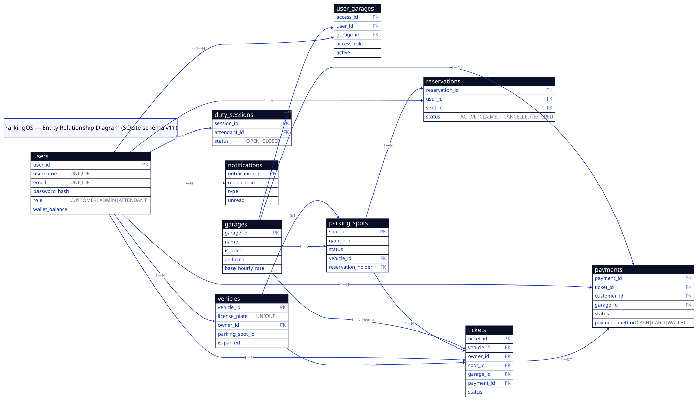

# ParkingOS Data Model

Entity-relationship view of the SQLite store (schema v11,
`persistence/PersistenceStore.java:38`). Diagram source:
`diagrams/erd.d2` — re-render with `scripts/render_diagrams.sh` after any change.

## Ownership rules

- A **Ticket** is owned by exactly one **Garage** from entry through closeout
  (`model/Ticket.java:18` `garageId`; FK `tickets.garage_id → garages` RESTRICT).
  Same for **Payment** (`model/Payment.java:19`).
- **Garage access** (`GarageAccess.java:8-13` / `user_garages` table) is the only
  N—N join: `UNIQUE(user_id, garage_id)`, both FKs `CASCADE`.
- **Archived garage** (`Garage.archived`): closed to new operational work
  (`GarageService.archiveGarage:43`); tickets/payments/reservations/reports stay
  queryable for authorized administrators.
- `ParkingGarage` (`model/ParkingGarage.java:20-31`) is the live in-memory view,
  not a separate table: `saveGarage` writes `garage_config` + backfills `garages`
  (`PersistenceStore.java:510-520`).

## Tables

| Table | Key columns | Foreign keys | Origin |
|---|---|---|---|
| `users` | `user_id` PK, `username`/`email` UNIQUE, `password_hash`, `role`, `wallet_balance` | — | `initializeSchema:100` |
| `garages` | `garage_id` PK, `name`, `is_open`, `archived`, rates/holds | — (+ numeric CHECKs) | `migrateGarageSchema:150` |
| `user_garages` | `access_id` PK, `user_id`, `garage_id`, `access_role`, `active` | `user_id → users` CASCADE, `garage_id → garages` CASCADE | `migrateGarageSchema:151` |
| `garage_config` (legacy) | `garage_id` PK, `name`, `is_open` | — | `initializeSchema:115` |
| `vehicles` | `vehicle_id` PK, `license_plate` UNIQUE NOCASE, `owner_id`, `parking_spot_id`, `is_parked` | `owner_id → users` SET NULL | `initializeSchema:117`, FK-hardened `:211` |
| `parking_spots` | `spot_id` PK, `garage_id` NOT NULL, `status`, `vehicle_id`, `reservation_holder` | `vehicle_id → vehicles` RESTRICT, `reservation_holder → users` SET NULL (`garage_id` enforced in app, `saveParkingSpot:622-635`) | `initializeSchema:118`, FK-hardened `:212` |
| `tickets` | `ticket_id` PK, `vehicle_id`, `owner_id`, `spot_id`, `garage_id` NOT NULL, `status`, `payment_id` | `vehicle_id/spot_id/garage_id/payment_id` RESTRICT, `owner_id → users` SET NULL | `initializeSchema:109`, `garage_id` added `:160`, FK-hardened `:213` |
| `payments` | `payment_id` PK, `ticket_id` NOT NULL, `customer_id`, `garage_id` NOT NULL, `status`, `payment_method` | `ticket_id/garage_id` RESTRICT, `customer_id → users` SET NULL | `initializeSchema:110`, `garage_id` added `:161`, FK-hardened `:214` |
| `reservations` | `reservation_id` PK, `user_id` NOT NULL, `spot_id` NOT NULL, `status` CHECK | `user_id → users` CASCADE, `spot_id → parking_spots` CASCADE | `initializeSchema:119` |
| `duty_sessions` | `session_id` PK, `attendant_id` NOT NULL, `status` CHECK(`OPEN`,`CLOSED`) | `attendant_id → users` CASCADE; partial unique: ≤1 `OPEN` per attendant (`:126`) | `initializeSchema:121-126` |
| `notification_prefs` | `user_id` PK, `enabled_types`, `frequency` | logical `user_id` | `initializeSchema:111` |
| `notifications` | `notification_id` PK, `recipient_id`, `type`, `unread` | logical `recipient_id` | `initializeSchema:112` |
| `audit_events` | `event_id` PK AUTOINCREMENT, `action`, `actor_id`, `success` | — | `initializeSchema:114` |
| `schema_version` | `version` PK | — | `ensureSchemaVersionTable:246` |

## Relationships

- `User 1—N Vehicle / Ticket / Payment` (FKs `SET NULL`; indexes
  `idx_vehicles_owner:130`, `idx_tickets_owner:131`, `idx_payments_customer:137`).
- `Vehicle 1—N Ticket`; ≤1 active session per vehicle (partial unique
  `idx_tickets_active_vehicle WHERE ACTIVE/AWAITING_PAYMENT:142`).
- `ParkingSpot 1—N Ticket`; occupancy `Vehicle 1—0/1 ParkingSpot`
  (partial unique `idx_parking_spots_vehicle WHERE NOT NULL:140`).
- `Ticket 1—0/1 Payment` (FKs both directions, RESTRICT).
- `Garage 1—N ParkingSpot / Ticket / Payment`.
- `User N—N Garage` via `user_garages`.
- `User 1—N Reservation`, `ParkingSpot 1—N Reservation`.
- `Attendant 1—N DutySession`; `User 1—1 NotificationPreference`,
  `User 1—N Notification`.

## Single-table inheritance (no separate tables)

- `User ← Admin / Attendant / Customer`, discriminator `users.role`.
- `Payment ← Card / Cash / WalletPayment`, discriminator
  `payments.payment_method`. Card numbers/CVV are never persisted
  (see `README.md` security notes).

## Enums

- `TicketStatus`: `CREATED, ACTIVE, CLOSED, CANCELLED, AWAITING_PAYMENT, PAID, REFUNDED`.
- `ReservationStatus`: `ACTIVE, CLAIMED, CANCELLED, EXPIRED`.
- `SpotStatus`: `AVAILABLE, OCCUPIED, RESERVED, UNDER_MAINTENANCE, OUT_OF_SERVICE`.
- `PaymentStatus`: `PENDING, COMPLETED, FAILED, REFUNDED, CANCELLED`.
- `UserRole`: `CUSTOMER, ADMIN, ATTENDANT`; duty-session status is a validated
  string (`OPEN, CLOSED`).
