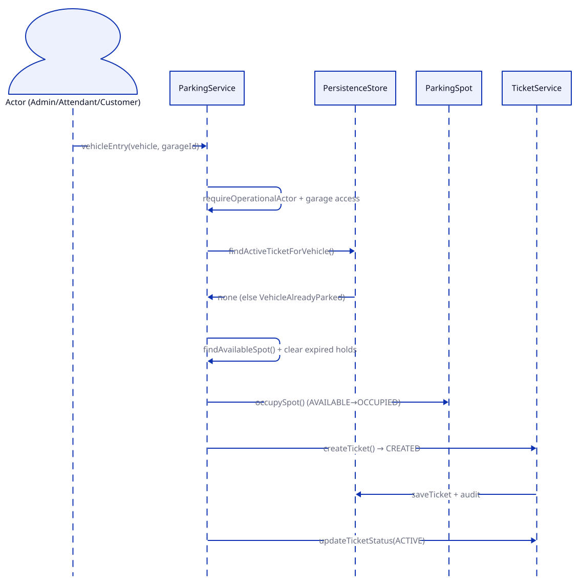
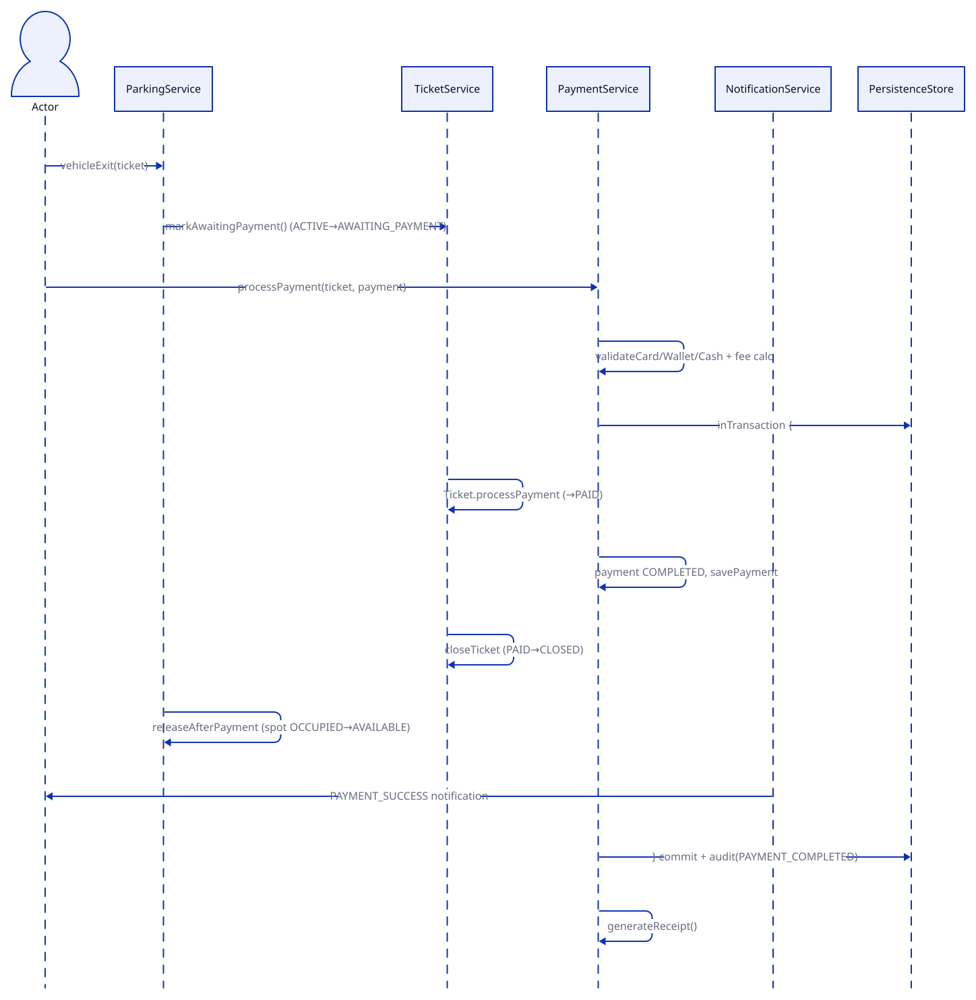
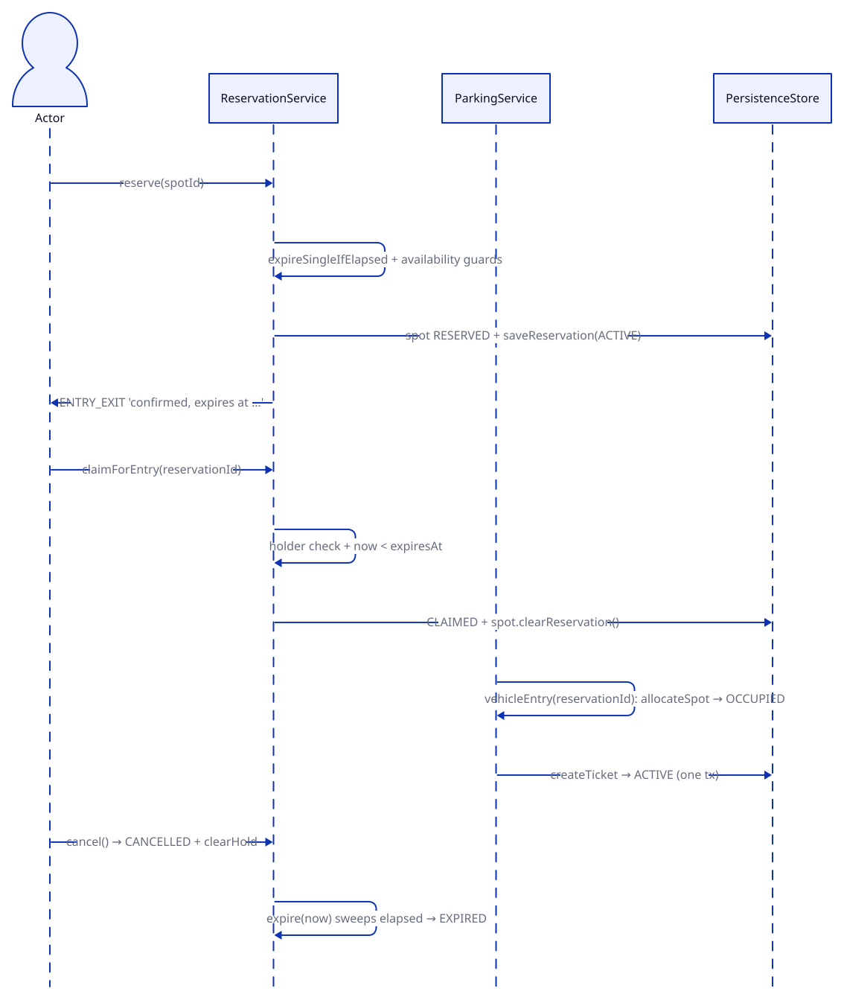
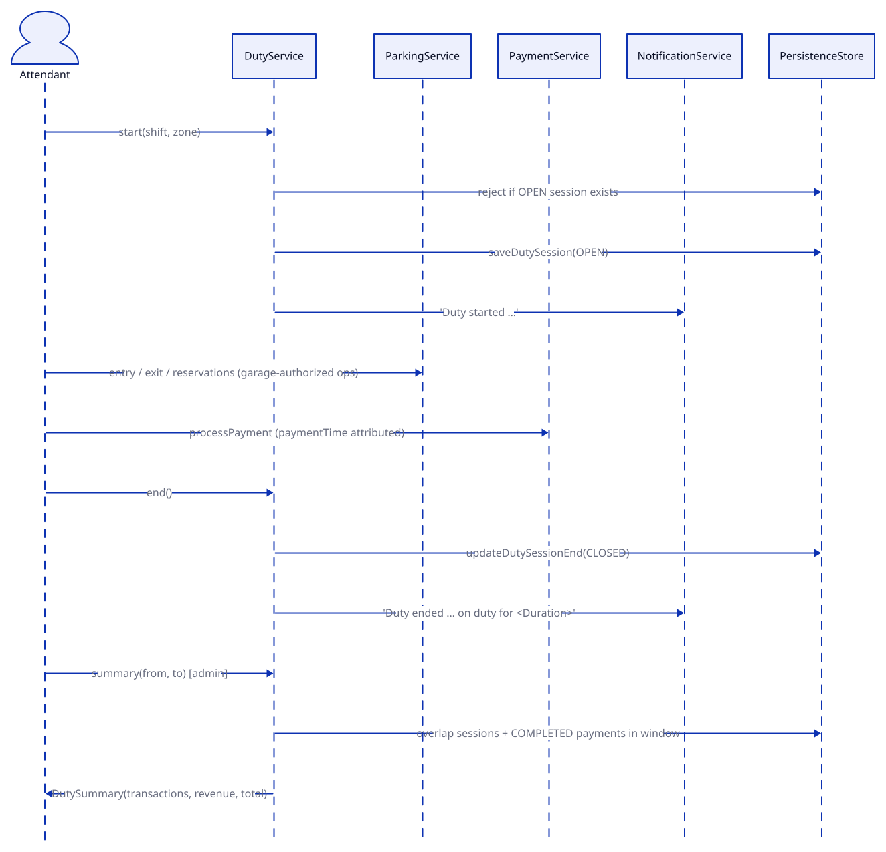

# ParkingOS Operational Flows

Sequence views of the four core workflows. Diagram sources
(`diagrams/flows-*.d2`) — re-render with `scripts/render_diagrams.sh`.

## 1. Vehicle entry → ticket

1. `ParkingService.vehicleEntry(vehicle, garageId, actor)` (`ParkingService.java:129`):
   `requireOperationalActor` (`:371`) + garage binding/access check (`:132-136`).
   Closed garage → `IllegalStateException` (`:83`).
2. `ensureVehicleNotParked` (`:146`): `findActiveTicketForVehicle` — duplicate
   entry throws `VehicleAlreadyParkedException`.
3. `findAvailableSpot` (`:464`): clears expired holds (`:478`), iterates allowed
   spot types (`:420`); none free → `SpotNotAvailableException`.
4. In `inTransaction` (`parkVehicle:99-104`): `allocateSpot` (`:551`,
   `occupySpot`) → `TicketService.createTicket` (`TicketService.java:69`,
   status `CREATED`, garage/spot checks `:72-76`) →
   `updateTicketStatus(ACTIVE)` (`:239`) → link ticket to customer (`:284`).
   Failure rolls back ticket, spot, vehicle, and garage registration (`:113-122`).

## 2. Payment → exit (cash / card / wallet)

1. `ParkingService.vehicleExit(ticket)` (`:319`): computes amount for
   `AWAITING_PAYMENT` (`:328`); requires `ACTIVE` else
   `InvalidTicketStatusException` (`:333`); in tx sets exit time, calculates
   amount, `TicketService.markAwaitingPayment` (`TicketService.java:374`).
2. `PaymentService.processPayment(ticket, payment)` (`PaymentService.java:76`,
   auth wrapper `:197`): guards (duplicate id, already paid, must be
   `AWAITING_PAYMENT`, `:88-95`); fee = `ticket.calculateAmount` + `Money`
   rounding + `AppConfig` tax (`:120-123`; rate logic `calculateParkingFee:234`,
   ceil-hours × spot rate).
3. Method validation — `validateCardPayment:259`, `validateWalletPayment:274`,
   `validateCashPayment:289` — then `payment.processPayment(final)` (`:131`;
   computes change / masked card / wallet debit). Gateway failure persists
   `FAILED` and throws (`:133-139`).
4. Atomic commit (`:147-165`): ticket `→ PAID` (`:148`) → payment `COMPLETED` +
   `savePayment` → `closeTicket` (`→ CLOSED`, `:158`) →
   `releaseAfterPayment` (frees spot, `:159`) → `audit(PAYMENT_COMPLETED)` (`:161`)
   → `PAYMENT_SUCCESS` notification (`publishPaymentNotification:374`).
5. Receipt: `generateReceipt:421` (ids, method, time, status, amount/tax/final).

## 3. Reservation hold → claim-and-park → expiry

No background timer — expiry is lazy plus explicit sweep.

1. Hold — `ReservationService.reserve(actor, spotId, now)` (`:42`):
   `requireOperationalActor` (`:268`), clears elapsed holds (`:215`), guards spot
   availability (`:57-60`); in tx sets spot `RESERVED`, persists `ACTIVE` (`:67-74`),
   publishes `ENTRY_EXIT` confirmation with expiry (`:76`).
2. Claim-and-park — `claimForEntry` (`:140`): holder check (`:263`),
   customer-owns-vehicle (`:157`), `now < expiresAt` else expire + throw (`:160`),
   spot `RESERVED`-by-holder checks (`:166-169`); in tx `CLAIMED` (`:175`) +
   clear hold (`:176`) + notify (`:179`). Caller
   `ParkingService.vehicleEntry(actor, vehicle, reservationId)` (`ParkingService.java:189`)
   claims, allocates (`OCCUPIED`), and creates + activates the ticket in one tx
   (`:205-216`).
3. Cancel — `cancel:90`: `CANCELLED` (`:107`) + clear hold (`:109`).
4. Expiry — `expire(now):127` sweeps `loadActiveReservations`, `expireSingle:222`
   sets `EXPIRED` + clears hold + notifies (`:227-233`); also via
   `ParkingService.releaseExpiredReservations:482` during spot search.

## 4. Attendant duty → shift summary

1. Start — `DutyService.start(actor, shift, zone, now)` (`DutyService.java:52`):
   `ADMIN`/`ATTENDANT` only (`:283`); rejects if an `OPEN` session exists (`:63`,
   partial-unique index); persists `OPEN` (`:62-68`), publishes `ENTRY_EXIT`
   "Duty started" (`:68`).
2. Operations — while `OPEN` (`current:110`), the attendant runs flows 1–3 under
   garage-access authorization; `paymentTime` attributes revenue to the shift.
3. End — `end(actor, now)` (`:85`): requires open session (`:88`) and
   `now >= startedAt` (`:90`); persists `CLOSED` (`:94`), publishes "Duty ended …
   on duty for \<Duration\>" (`:97`).
4. Summary — admin-only (`requireAdmin:290`): `summary:124,130` and team
   `summaries:139` intersect sessions with `[from, to]` (`overlap:241`), attribute
   `COMPLETED` payments in-window (`:222`), and return
   `DutySummary(attendant, transactions, revenue, total)` (`:194-203`).
