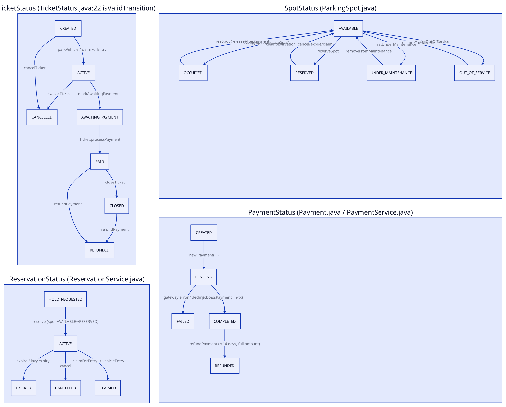

# ParkingOS Lifecycle (State Machines)

Status transitions for tickets, reservations, spots, and payments.
Diagram source: `diagrams/lifecycle.d2` — re-render with
`scripts/render_diagrams.sh` after any change.

## Ticket (`TicketStatus.java:6-13`, transitions `:22-42`)

Initial state is `CREATED` (`TicketService.createTicket:89`).

| From → To | Trigger |
|---|---|
| `CREATED → ACTIVE` | `ParkingService.parkVehicle:108`, reservation claim path `vehicleEntry:213`, via `TicketService.updateTicketStatus:239` |
| `CREATED → CANCELLED` | `TicketService.cancelTicket:585` |
| `ACTIVE → AWAITING_PAYMENT` | `TicketService.markAwaitingPayment:374` (requires `ACTIVE`), called by `ParkingService.vehicleExit:346` |
| `ACTIVE → CANCELLED` | `TicketService.cancelTicket:577` |
| `AWAITING_PAYMENT → PAID` | `Ticket.processPayment:84` (status check `:95`), called by `PaymentService.processPayment:148` |
| `PAID → CLOSED` | `TicketService.closeTicket:431` (requires `PAID`), called by `PaymentService.processPayment:158` |
| `PAID → REFUNDED` | `PaymentService.refundPayment:348` (guard `isValidTransition`) |
| `CLOSED → REFUNDED` | Same `refundPayment:348` path |
| `CANCELLED`, `REFUNDED` | Terminal — no outgoing transitions (`TicketStatus.java:37-40`) |

`PaymentService.processPayment:146-159` couples `AWAITING_PAYMENT → PAID → CLOSED`
plus `releaseAfterPayment` in one `inTransaction`; failure rolls back (`:166-193`).

## Reservation (`ReservationStatus.java:6-10`, `ReservationService.java`)

No background timer — expiry is lazy plus explicit sweep; `expiresAt =
now.plusMinutes(holdMinutes)`.

| From → To | Trigger |
|---|---|
| `(none) → ACTIVE` | `reserve:46` — persists `ACTIVE` (`:73`), sets spot `AVAILABLE → RESERVED` (`:68`), notifies (`:76`) |
| `ACTIVE → CLAIMED` | `claimForEntry:144` — sets `CLAIMED` (`:175`), clears spot hold (`:176`); caller `ParkingService.vehicleEntry(reservationId):205` allocates the spot and creates the ticket atomically |
| `ACTIVE → CANCELLED` | `cancel:90` — sets `CANCELLED` (`:107`), clears hold (`:109`) |
| `ACTIVE → EXPIRED` | `expire:127` sweep via `expireSingle:222` (sets `EXPIRED:227`, clears hold `:229`); also lazily from `reserve:56`, `claimForEntry:160`, `cancel:99` when `!now.isBefore(expiresAt)` |
| `CLAIMED` / `CANCELLED` / `EXPIRED` | Terminal — `cancel:96` and `claimForEntry:153` reject non-`ACTIVE` |

Failed claim-and-park restores the hold (`restoreHoldMemoryAfterFailedClaimPark`,
`ParkingService.java:233-267`).

## Spot (`SpotStatus.java:6-11`, `model/ParkingSpot.java`)

| From → To | Trigger |
|---|---|
| `AVAILABLE → OCCUPIED` | `occupySpot:43` (requires `isAvailable`), via `ParkingService.allocateSpot:557` |
| `AVAILABLE → RESERVED` | `reserveSpot:62` (requires `isAvailable`), via `ReservationService.reserve:68` or `ParkingService.reserveSpot:508` |
| `RESERVED → AVAILABLE` | `clearReservation:79` (only if `RESERVED`), via `clearHold:246` (cancel/expire/claim) or `clearReservationIfExpired:87` (swept by `releaseExpiredReservations:487`) |
| `RESERVED → OCCUPIED` | Indirect: claim clears to `AVAILABLE`, then `allocateSpot → occupySpot` in one tx (`ParkingService.java:205-216`) |
| `OCCUPIED → AVAILABLE` | `freeSpot:103` (preserves maintenance flags), via `ParkingService.freeSpot:597` and `releaseAfterPayment:411` (requires ticket `CLOSED`) |
| `AVAILABLE → UNDER_MAINTENANCE` | `setUnderMaintenance:126` (no-op if `OCCUPIED`/`RESERVED`) |
| `UNDER_MAINTENANCE → AVAILABLE` | `removeFromMaintenance:140` |
| `AVAILABLE` / `UNDER_MAINTENANCE → OUT_OF_SERVICE` | `setOutOfService:149` (no-op if `OCCUPIED`/`RESERVED`) |
| `OUT_OF_SERVICE → AVAILABLE` | `restoreToAvailable:160` |

## Payment (`PaymentStatus.java:6-11`, `model/Payment.java`)

| From → To | Trigger |
|---|---|
| `(new) → PENDING` | `Payment` constructors (`Payment.java:28-46`) |
| `PENDING → COMPLETED` | `processPayment:62` (sets `COMPLETED:73`), orchestrated by `PaymentService.processPayment:129-152` inside the ticket tx |
| `PENDING → FAILED` | Gateway exception or declined (`PaymentService:132-139`), persisted then thrown |
| `COMPLETED → REFUNDED` | `processRefund:96` (requires `canBeRefunded:97` — `COMPLETED` + within 0–14 days, full amount only), via `PaymentService.refundPayment:337` |

`CANCELLED` is defined in the enum but never set in code.

## Invalid-transition exceptions

- `InvalidTicketStatusException` — all ticket guards: `TicketService.updateTicketStatus:243`
  (any `!isValidTransition`), `markAwaitingPayment:379` (not `ACTIVE`),
  `closeTicket:436` (not `PAID`), `cancelTicket:580` (not `CREATED`/`ACTIVE`),
  `ParkingService.vehicleExit:333` (not `ACTIVE`; `AWAITING_PAYMENT`/`PAID`/`CLOSED`
  return early instead). (`updateStatuses:300` records per-ticket failures.)
- `SpotNotAvailableException` — spot guards: `ParkingService.allocateSpot:553`
  (not available), `findAvailableSpot:464` (no spot for type).
- `VehicleAlreadyParkedException` — duplicate entry:
  `ParkingService.ensureVehicleNotParked:146` (active ticket found), called by
  `vehicleEntry:89,200`.
- Misuse around reservations/payments raises `PaymentFailedException`
  (duplicate/paid/not-`AWAITING_PAYMENT`, `PaymentService:88-97`) or
  `IllegalStateException` (reservation guards, `ReservationService:57,96,153`).
